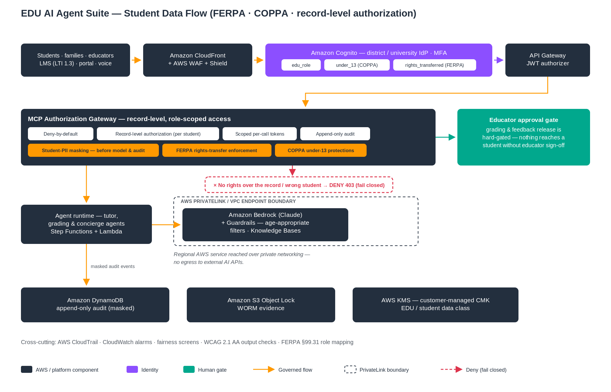

# EDU AI Agent Suite

> ### 🛡️ Part of the Aegis Governed-Agent Portfolio — one solution, five repositories
> This repository is **1 of 5 that form a single, review-as-one solution**: the **Aegis** governance
> platform (the control plane) plus four vertical agent packs. All five conform to one versioned
> governance contract — **AGP v1.0** — and one deploy pattern, so a CIO / CISO reviews and approves them
> **together** for pilot.
>
> | # | Repository | Role |
> |--:|---|---|
> | 1 | **`aegis-ai-governance-platform-aws`** | Governance **platform & pattern** (deny-by-default control plane) |
> | 2 | **`hcls-ai-agents`** | **Life sciences** — pharma / biotech / CRO |
> | 3 | **`slg-ai-agents`** | **State & local government** |
> | 4 | **`healthcare_ai_agents`** (**HPP**) | **Healthcare payer / provider** |
> | 5 | **`edu-ai-agents`** | **Education** — K-12 & higher-ed |
>
> **▶ You are here: `edu-ai-agents`.**
>
> **New to the portfolio?** Start in the **`aegis-ai-governance-platform-aws`** repo:
> `PORTFOLIO-EXECUTIVE-SUMMARY.md` (10-minute front door) → `SA-DEPLOYMENT-RUNBOOK.md` (deploy the
> platform + heroes in a new AWS account) → `PORTFOLIO-MATURITY-SCORECARD.md` (what's proven) →
> `DO-NOT-CLAIM.md` (the honesty boundary).
>
> **Naming:** **`healthcare_ai_agents` = HPP** (payer / provider: claims, prior-auth, denials) and
> **`hcls-ai-agents` = life sciences** (pharmacovigilance, clinical, regulatory) are **distinct
> products**; the underscore-vs-hyphen naming is historical.
>
> ---


> ⚠️ **Before you cite anything here:** read [**What we will *not* claim**](NOT-CLAIMS.md) — this is an independent reference accelerator that runs on AWS. It is **not** an AWS service, **not** AWS-supported, **not** an official AWS solution, and **not** a compliance certification. That page governs if any wording elsewhere reads stronger.

> 📊 **Honest status, one source of truth:** per-agent maturity, clean-account evidence, connector tiers, and the test count live in machine-readable [`MATURITY.yaml`](MATURITY.yaml); the four connector-maturity terms are defined in [`docs/CONNECTOR-MATURITY.md`](docs/CONNECTOR-MATURITY.md). Prose defers to `MATURITY.yaml`; a portfolio drift-checker (`tools/check_maturity.py`) keeps them aligned.

> 🔗 **Conforms to the Aegis Governance Pattern (AGP) v1.0.** The 8 required controls (identity, deny-by-default gateway, least-privilege intersection, bound SoD approval, fail-closed masking, append-only+WORM audit, token budgets, model gateway+grounding) are mapped to their implementing module and proving test in [`AGP-CONFORMANCE.md`](AGP-CONFORMANCE.md).

> ™ **Brand & trademark:** collateral follows two tracks — an **internal-AWS** track (approved templates only) and a **customer-safe public** track (neutral branding, plain-text "Built on AWS", no AWS logo). Rules in [`BRAND-AND-TRADEMARK.md`](BRAND-AND-TRADEMARK.md). Nothing here implies AWS sponsorship or endorsement.

> 🧭 **Part of the governed-agent portfolio.** This pack conforms to the **Aegis Governance Pattern (AGP v1.0)**; **Aegis** (`aegis-ai-governance-platform-aws`) is the hub — see its `PORTFOLIO-START-HERE.md` (how the packs flow together) and `DEPLOY-EVERYTHING.md` (deploy everything end-to-end).

> 📚 **Governance & readiness docs (this repo):** [`NOT-CLAIMS`](NOT-CLAIMS.md) · [`MATURITY.yaml`](MATURITY.yaml) · [`Connector maturity`](docs/CONNECTOR-MATURITY.md) · [`AGP conformance`](AGP-CONFORMANCE.md) · [`Operating model`](OPERATING-MODEL.md) · [`Release packet`](RELEASE-PACKET.md) · [`AWS run-cost`](AWS-RUN-COST.md) · [`Brand & trademark`](BRAND-AND-TRADEMARK.md)

### Governed AI Agents for Education — Built on Amazon Bedrock

> **Independent, open-source reference accelerator** for K–12 districts, community colleges, universities, online programs, and workforce-education providers. Eight AI agents that retrieve, analyze, draft, and recommend — while humans keep every consequential decision. Built on Amazon Bedrock with deny-by-default authorization, student-PII masking, human-in-the-loop enforcement, and a tamper-evident audit trail aligned to FERPA, COPPA, IDEA/504, ADA Title II, and state student-privacy law.

> **What this is not:** an AWS service, a compliance certification, a penetration-tested product, or a turnkey deployment. Production requires customer-specific identity integration, connectors, security review, and legal/privacy sign-off. If you work at AWS, obtain internal approval before using this as a customer-facing asset.

> **Maturity is governed by one authoritative file:** [`docs/STATUS-MANIFEST.md`](docs/STATUS-MANIFEST.md) — the per-agent / per-control capability matrix that every status statement in this repo derives from. New here? Start with the [documentation index](docs/README.md).

## Capability maturity matrix

✅ = evidence in this repo (code + passing test, shipped template, or documented artifact) · ◻ = not done here / customer-engagement work.
Derived from the authoritative [`MATURITY.yaml`](MATURITY.yaml). **✅ in the *Deployed on AWS* column reflects the Agent-01 pilot** — a real CloudFormation stack deployed to `CREATE_COMPLETE` and verified live on **2026-07-12** (live College Scorecard retrieval + real grounded Bedrock answer, deny-by-default + record-scope DENY, HITL PENDING_APPROVAL, runtime PII masking, append-only CMK-encrypted audit), then torn down — plus the 2026-07-10 Cognito-JWT and axe-core evidence (see [`docs/evidence/`](docs/evidence/)). The **full `quickstart.yaml` nested stack** (VPC/edge/AgentCore/real IdP/real SIS) is not yet stood up, so *Integration-tested on AWS* and *Production-ready* stay empty.

| Capability | Designed | Implemented (offline/tested) | Deployed on AWS (validated) | Integration-tested on AWS | Production-ready | Owner (Repo/Customer) |
|---|:--:|:--:|:--:|:--:|:--:|---|
| Identity / authN | ✅ | ✅ | ✅ | ◻ | ◻ | Repo (real Cognito JWT verified by the prod `verify_jwt` path on AWS 2026-07-10; real external IdP federation: Customer) |
| MCP / tool authorization gateway | ✅ | ✅ | ✅ | ◻ | ◻ | Repo (deny-by-default governed flow proven live in the Agent-01 pilot 2026-07-12) |
| Policy enforcement (deny-by-default) | ✅ | ✅ | ✅ | ◻ | ◻ | Repo (fail-closed record-level scope: cross-record DENY proven live 2026-07-12) |
| Human approval (SoD, single-use) | ✅ | ✅ | ✅ | ◻ | ◻ | Repo (signed single-use approvals + reviewer service; consequential PENDING_APPROVAL proven live 2026-07-12) |
| PII/PHI masking | ✅ | ✅ | ✅ | ◻ | ◻ | Repo (runtime student-PII masking proven live in the deployed Lambda 2026-07-10/12) |
| Audit (append-only + WORM) | ✅ | ✅ | ✅ | ◻ | ◻ | Repo (append-only masked write to a DEPLOYED CMK-encrypted DynamoDB audit table proven live 2026-07-10/12; S3 WORM export: Customer) |
| Bedrock + Guardrails | ✅ | ✅ | ✅ | ◻ | ◻ | Repo (real Claude invocation + guardrail proven live in the deployed Lambda 2026-07-10/12) |
| IaC deploy (golden path) | ✅ | ✅ | ✅ | ◻ | ◻ | Repo (Agent-01 pilot + golden-path CFN stacks deployed to CREATE_COMPLETE + verified live 2026-07-12; full quickstart nested stack: Customer) |
| Live connectors | ✅ | ✅ | ✅ | ◻ | ◻ | Repo (live College Scorecard retrieval proven in the deployed pilot 2026-07-12; real SIS/LMS: Customer) |
| CI/CD | ✅ | ✅ | ◻ | ◻ | ◻ | Repo (blocking cfn-lint + bandit/pip-audit/detect-secrets/checkov/SBOM; no cloud deploys in CI) / Customer |
| Monitoring / alerts | ✅ | ✅ | ◻ | ◻ | ◻ | Customer (`observability.yaml` alarms + dashboard ship as templates, un-deployed-as-tested) |
| DR / backup | ✅ | ✅ | ◻ | ◻ | ◻ | Customer (audit-table PITR enabled in the deployed pilot; multi-Region DR: Customer) |
| Compliance evidence | ✅ | ✅ | ✅ | ◻ | ◻ | Repo (assurance docs + golden-transaction + pilot deploy evidence; axe-core WCAG pass) / Customer (conformance + sign-off) |

Nothing in this repository is production-certified; see [`docs/PRODUCTION-READINESS-ACTION-PLAN.md`](docs/PRODUCTION-READINESS-ACTION-PLAN.md) and [`docs/STATUS-MANIFEST.md`](docs/STATUS-MANIFEST.md) for the full ownership breakdown (RACI).

*Governance once, agents as add-ons: `platform_core` (`edu-agent-platform` 0.1.0) **implements the Aegis Governance Pattern (AGP) v1.0** — the shared governance contract defined in the Aegis platform repo (`docs/14-GOVERNANCE-PATTERN-VERSIONING.md`). Conformance is declared in `platform_core/edu_agent_platform/__init__.py` (`AEGIS_GOVERNANCE_PATTERN_VERSION`) and asserted by `platform_core/tests/test_agp_conformance.py`.*

> **Validation update (2026-07-12) — Agent 01 pilot deployed on AWS.** A real CloudFormation stack (`infra/cloudformation/pilot-concierge.template.json`) deployed the governed concierge and was verified across four scenarios live, then torn down: **public info** → ALLOW with **live College Scorecard** retrieval + a real grounded Bedrock answer (Michigan 15.6%% admit / $17,736 in-state); **own record** → ALLOW (synthetic SIS); **cross-record** → DENY (record-scope); **consequential send** → PENDING_APPROVAL (HITL). Append-only CMK-encrypted audit, runtime PII masking. Zero residual resources; under $1. Canonical offline suite: **200 passed, 1 skipped**. Evidence: [`docs/evidence/pilot-deploy.md`](docs/evidence/pilot-deploy.md) · runbook: [`runbooks/agent-deploy/01-PILOT.md`](runbooks/agent-deploy/01-PILOT.md). STILL OPEN: the full `quickstart.yaml` nested stack, real IdP federation, real SIS connector, pen test, manual WCAG.

### Hero pilot — Student & Family Concierge (lead, low-blast-radius)

Agent 01 (**Student & Family Concierge**) is the recommended lead pilot: it answers, retrieves, and drafts, but touches no student education record to prove value, so it is the lowest-blast-radius way to stand the governed pattern up against a **real system of record**.

It now ships a **REAL, read-only connector to the public [U.S. Department of Education College Scorecard API](https://collegescorecard.ed.gov/data/documentation/)** — genuine institution / cost / aid / admissions facts a concierge would consult — wired behind the same governance the whole suite uses:

- **Governed.** Every read flows through the deny-by-default MCP gateway with least-privilege intersection (agent grant ∩ user entitlement), a per-call scoped token, and an append-only masked audit. A student cannot send outbound messages; a consequential family message is **human-gated** (`PENDING_APPROVAL`) until a verified approval is bound. Connector writes raise `NotImplementedError` — student-record writes stay human-gated to the SIS.
- **Student-PII masked (FERPA/COPPA).** The masker runs fail-closed on every ingested summary even though Scorecard carries no PII, so the control is exercised, not assumed.
- **Offline + live demo.** `SCORECARD_OFFLINE=1 python demo/demo_collegescorecard.py` (cassette, no network) or live against `api.data.gov` with `DEMO_KEY`; cassette-backed tests mean **no network in CI**.
- **Scored quality benchmark.** `make eval-concierge` runs a labeled 20-case benchmark against thresholds — classification accuracy ≥ 0.90, entity F1 ≥ 0.85, grounding ≥ 0.90, answer completeness ≥ 0.95, duplicate/near-duplicate detection ≥ 0.90, and a **student-PII-leak-rate = 0 hard gate** — gated in CI (`evals` job, deterministic, no API key; uploads `eval-report-concierge.md`).

Honest scope: this is a **reference accelerator**. College Scorecard is *public institution data*, not a student record — real SIS/LMS connectors (PowerSchool, Banner, Canvas, …) that touch the education record are separate, human-gated engagement work with FERPA sign-off. Connector: [`platform_core/edu_agent_platform/connectors/collegescorecard.py`](platform_core/edu_agent_platform/connectors/collegescorecard.py) · switch: `CONNECTOR_MODE=live CONCIERGE_SOURCE=collegescorecard`.

---

## Table of Contents

- [Quick Start — Get Running in Minutes](#quick-start)
- [The Problem This Solves](#the-problem-this-solves)
- [The Eight Agents](#the-eight-agents)
- [Stakeholder Positioning](#stakeholder-positioning)
  - [For the CIO / Director of Architecture](#for-the-cio--director-of-architecture)
  - [For the CISO / Privacy Officer](#for-the-ciso--privacy-officer)
  - [For Academic Leadership (Provost, CAO)](#for-academic-leadership)
  - [For the CFO / VP Finance](#for-the-cfo--vp-finance)
- [Security & Regulatory Alignment](#security--regulatory-alignment)
- [Platform Architecture](#platform-architecture)
- [Deploy to AWS — Step by Step](#deploy-to-aws--step-by-step)
- [Repository Structure](#repository-structure)
- [Maturity & Roadmap](#maturity--roadmap)
- [Compliance Disclaimer](#compliance-disclaimer)

---

<a id="quick-start"></a>
## Quick Start — Get Running in Minutes

No AWS account needed to see the agents work. Every agent runs locally in demo mode with deterministic fixtures — no API keys, no cloud, no cost.

### Prerequisites

- Python 3.10+ and pip
- Git
- Docker (optional, for container path)

### 1. Clone and install

```bash
git clone https://github.com/virtualryder/edu-ai-agents.git
cd edu-ai-agents
make install                      # platform_core (editable) + pytest, langgraph, langchain-core, streamlit
```

### 2. Run any agent locally (demo mode)

```bash
export EXTRACT_MODE=demo          # deterministic fixtures, no LLM calls
cd 01-student-family-concierge
streamlit run app.py              # opens a browser UI
```

Every agent includes a Streamlit demo app, fixture data, and tests that run without credentials.

### 3. Run the test suite

```bash
make test                         # runs the governance + agent suites (canonical offline total: 201 tests — see MATURITY.yaml; +7 provisioner tests via `make test-provisioner`)
```

### 4. Validate CloudFormation templates

```bash
make lint                         # cfn-lint on all 9 CloudFormation templates
```

### 5. When you're ready for AWS

Follow the [step-by-step AWS deployment guide](#deploy-to-aws--step-by-step) below, or jump straight to the golden-path runbook:

```bash
# One-command deploy for Agent 01 (Concierge) — the recommended first agent
make golden-path-01 \
  LAMBDA_BUCKET=my-lambda-bucket \
  TEMPLATE_BUCKET=my-cfn-bucket \
  IDP_METADATA=https://your-idp/metadata
```

**Prove the full chain locally (no AWS):** `python 01-student-family-concierge/demo/golden_transaction.py` runs identity → gateway → scoped token → connector → signed single-use human approval → result → masked audit and writes an evidence bundle. The human-in-the-loop reviewer is in `platform_core/edu_agent_platform/reviewer/` (`streamlit run .../reviewer/app.py`).

---

<a id="the-problem-this-solves"></a>
## The Problem This Solves

Every institution is already paying for these problems — in staff time, lost tuition, replacement hiring, and compliance exposure. These agents target the eight workflows where that cost is largest and most measurable.

| Problem | What it costs today |
|---|---|
| **Families can't self-serve.** Routine questions about status, aid, deadlines, and schedules bury staff. ~4M of 5.4M FAFSA-cycle calls went unanswered *(GAO, 2024)* | **~$1.2M–$1.6M/yr** in avoidable contact handling |
| **No scalable tutoring after hours.** A purpose-built AI tutor drove >2× learning in an RCT *(Harvard, 2024)* | **~$1.2M–$2.5M/yr** to match with human tutoring for 1,000 students |
| **Teachers are drowning.** 53 vs. 44 hrs/wk with ~4.4 hrs to plan *(RAND, 2024)*. Replacing one burned-out teacher costs $11,860–$24,930 *(LPI, 2024)* | **~$2.2B/yr nationally** in teacher turnover |
| **Grading eats time.** ~9.9 hrs/wk on grading; feedback arrives too late to help *(2025 survey)* | **~$4,270/instructor/yr** in recoverable labor |
| **Students leave before anyone acts.** Warning signs accumulate in separate systems. 22.4% of first-years don't return *(NSC, 2025)* | **~$5.6M/yr** in forgone recurring tuition |
| **Transfer students lose credits.** ~43% of credits lost on average *(GAO / CHEPP)* | **$13,081–$26,396** added cost per transfer student |
| **Documents pile up, accessibility deadlines loom.** ADA Title II (WCAG 2.1 AA) due Apr 2027/2028; ~95% of accessibility complaints are PDFs | **$665K–$815K** program-scale remediation + federal-funding risk |
| **IT help desk is buried.** Password/access tickets are 20–50% of volume at ~$70/reset | **~$300K/yr** in deflectable tickets |

**How the suite solves it:** Each agent follows the same governed pipeline — **retrieve** approved content and the user's own records through a deny-by-default gateway → **analyze** the request → **draft or recommend** an action → **stop at a framework-enforced human gate** for anything consequential → **write a tamper-evident audit record**. The agent deflects routine load and answers any hour in any language, while a named human keeps every grade, enrollment change, financial commitment, and privileged action.

---

<a id="the-eight-agents"></a>
## The Eight Agents

### Recommended deployment order

Start where decision-risk is low and visible return is high. The governed platform (gateway, identity, audit, HITL) is proven on the first agent and shared by every agent after it.

| Phase | Agents | Why |
|---|---|---|
| **Land** | **01 — Concierge** | Most visible to the most users, lowest risk, easiest to measure |
| **Expand (best-first)** | **03 — Educator Copilot**, **07 — Document & Accessibility**, **08 — Service Desk** | Broad visibility, low decision-risk, mature workflows |
| **Deepen (higher-governance)** | **02 — Tutor**, **04 — Assessment**, **05 — Student Success**, **06 — Pathway Navigator** | Touch learning and student outcomes directly; require stronger evaluation, bias testing, and educator oversight |

---

### Agent 01 — Student & Family Services Concierge
**The best first deployment. Start here.**

**The challenge:** Education information is scattered across websites, PDFs, portals, and staff inboxes. Families don't know which department to contact or what institutional terms mean. Seasonal peaks (enrollment, FAFSA, registration) overwhelm staff, and calls go unanswered.

**What it does:**
- **Public mode (unauthenticated):** Answers questions about enrollment, financial aid, calendars, transportation, meals, and deadlines — grounded in approved institutional content, never invented
- **Authenticated mode:** Checks application/FA status, retrieves schedules, books advising appointments, opens cases, sends forms, and escalates — all scoped to the acting user's own records
- Multilingual (Amazon Translate/Polly), multi-channel (Amazon Connect voice/SMS/chat, web, mobile)

**Proof points:** UA-Pulaski Tech: 94.5% adoption, 253% admissions-engagement lift. Highline College: 75% reduction in FA status contacts.

**Key regulations:** FERPA, COPPA, ADA/508/WCAG 2.2 AA, Title VI language access

---

### Agent 02 — Personalized Tutor & Study Companion

**The challenge:** Students need help outside class hours at a scale human tutoring cannot meet. Generic public AI has no course context, no safeguards, and will complete assignments for students.

**What it does:**
- Curriculum-grounded, instructor-controlled Socratic tutoring: hints not answers, concept explanations, practice questions, prerequisite review, study planning
- Instructor configures source material, pedagogy, tone, prohibited behaviors, and assistance level
- **Never completes a graded or prohibited assessment** — enforced by Bedrock Guardrails, not just prompting
- Knowledge base segmented by institution/course/section/role

**Key regulations:** FERPA, COPPA, IDEA/504 accommodations, academic-integrity policy

---

### Agent 03 — Educator Copilot

**The challenge:** Educators spend disproportionate time adapting content for different levels, languages, and needs, and navigating complex LMS screens. Planning time is ~4.4 hrs/wk against 53-hr work weeks.

**What it does:**
- Drafts lesson plans, differentiates by level/language/accommodation, builds rubrics and quizzes, aligns to standards
- Executes scoped LMS actions: extend deadlines, create rubric drafts, copy material, draft announcements, summarize discussions
- **Draft-first pattern — nothing reaches students without educator approval**

**Proof points:** ED 2025 guidance supports AI instructional materials. Instructure IgniteAI validates the review-then-permit pattern.

**Key regulations:** FERPA, ADA/508/WCAG 2.2 AA, state content standards, ED 2025 AI guidance

---

### Agent 04 — Assessment, Grading & Feedback

**The challenge:** Detailed, timely feedback is high-leverage but time-expensive. Instructors spend ~9.9 hrs/wk grading, and delayed feedback loses instructional value.

**What it does:**
- Rubric-grounded evaluation of open-ended work, draft feedback, misconception identification, reteaching suggestions
- Reads handwritten/scanned work (Textract) and evaluates spoken responses (Transcribe)
- **Deterministic rubric scoring service (not LLM)** paired with AI analysis, confidence routing, and human review
- **Final grades always under educator control — especially high-stakes**

**Proof points:** Benchmark Education (open-ended literacy assessment on Bedrock). Code.org (AI teaching assistant cuts assessment time by up to 50%).

**Key regulations:** FERPA, IDEA/504, accreditation/grading integrity

---

### Agent 05 — Student Success & Proactive Engagement

**The challenge:** Warning signs (attendance, missing work, disengagement) accumulate in separate systems. No one assembles them in time. Staff can't run timely, personalized outreach at scale. 22.4% of first-years don't return.

**What it does:**
- **Evidence assembly:** Combines authorized signals (attendance, grades, engagement, behavior, surveys, prior interventions) under strict domain-combination limits, summarizes patterns, proposes interventions, drafts cases
- **Proactive outreach:** On EventBridge signals, selects approved templates, personalizes, translates, sends through authorized channels (Connect/SES/SNS), monitors response
- **Prediction is separated from evidence-assembly.** The agent assembles evidence for a human decision-maker — it does not autonomously flag, rank, or discipline students

**Key regulations:** FERPA, PPRA (no protected-category inference), equity/anti-discrimination (four-fifths disparate-impact screen, FP/FN monitoring)

---

### Agent 06 — Academic, College & Career Pathway Navigator

**The challenge:** Advisors carry large caseloads navigating complex, changing rules (graduation, prerequisites, transfer, CTE, credentials). Students wait weeks, register wrong, miss prerequisites, or miss pathways entirely. Transfer students lose ~43% of credits on average.

**What it does:**
- Course planning, graduation-requirement checking, transfer-credit mapping, college exploration, CTE/credential pathways, career/skills exploration, counselor scheduling
- **Authoritative pathway logic runs in a deterministic rules engine, NOT the LLM** — the agent explains and recommends, the engine computes
- Explicit three-tier distinction: Option (could take) → Recommendation (agent suggests) → Approved Plan (human signed)

**Key regulations:** FERPA, accreditation/transfer-articulation, student placement on the bright-line list

---

### Agent 07 — Document & Accessibility Services

**The challenge:** Enrollment is the most document-intensive, seasonal, deadline-sensitive process in education. Meanwhile, ADA Title II (WCAG 2.1 AA) deadlines are Apr 2027/2028, and ~95% of accessibility complaints are PDFs. Both problems compete for the same scarce staff.

**What it does:**
- **Enrollment documents:** Classifies, extracts fields (Textract), validates completeness, identifies discrepancies, requests missing items, prepares structured SIS updates — human-verified before commit
- **Accessibility transformation:** Transforms approved content into multiple languages, plain-language/reading-level variants, captions/transcripts, audio (Polly), alt text, and accessible formats — WCAG pre-flight gated

**Proof points:** Illinois Institute of Technology: transcript evaluation from 4–6 weeks to ~1 day. Ohio State/Arizona State: PDF accessibility remediation at scale.

**Key regulations:** FERPA, COPPA, ADA/504/508, WCAG 2.2 AA, immunization/residency record rules, records retention

---

### Agent 08 — Operations / IT Service Desk

**The challenge:** IT and administrative staff support large, distributed populations with limited staffing. Password/access tickets are 20–50% of help-desk volume at ~$70/reset. Policy questions and document drafting consume hours that could go to strategic work.

**What it does:**
- **IT service desk:** Password/SSO resets, WiFi/device diagnostics, LMS access help, classroom tech support, outage status, ticket creation and routing
- **Staff knowledge & admin workflow:** Policy/procedure answers grounded in approved knowledge base, document drafting (scopes, RFPs, SOWs, board packets, policy comparisons), approval workflow initiation/tracking
- **Bright line between diagnostics (read) and privileged remediation (HITL-gated write).** Segregation of duties enforced.

**Key regulations:** FERPA (when staff handle student data), records management, segregation of duties, procurement policy

---

### The bright line: what these agents never decide

These are **bounded agents**. They retrieve, analyze, draft, recommend, and initiate low-risk workflows. They do **not** independently make final decisions about:

- **Grades or academic evaluations**
- **Admissions or enrollment decisions**
- **Discipline or behavioral consequences**
- **Financial aid awards or eligibility**
- **Special-education eligibility (IEP/504)**
- **Student placement**

Every consequential action is gated to a named, authorized human whose identity is bound into the audit record.

---

<a id="stakeholder-positioning"></a>
## Stakeholder Positioning

### For the CIO / Director of Architecture

**What you get:**
- **API modernization as a byproduct.** The governed MCP gateway exposes narrowly-scoped tools over your SIS, LMS, ERP, CRM, and ITSM. That's a modern, governed API surface useful beyond AI agents.
- **Build-once economics.** The authorization gateway, identity federation, PII masking, audit trail, and HITL gate are built once and shared by all eight agents. The marginal cost of agents 2–8 drops sharply.
- **No vendor lock-in.** Three implementation paths: Amazon Bedrock AgentCore Gateway (managed), API Gateway + Lambda (assembled from AWS primitives), or FastMCP (self-built, you own the code). The LLM factory abstracts Bedrock — swap models without touching agent code.
- **AWS-native, CloudFormation + Terraform.** Deploys into a customer-isolated VPC with KMS CMK encryption, PrivateLink to Bedrock, and infrastructure-as-code you can review line by line.

**Hand them:** `docs/SUITE-ARCHITECTURE.md` (six-layer reference architecture with full AWS service mapping)

### For the CISO / Privacy Officer

**What you get:**
- **Deny-by-default authorization.** `permitted(tool) ⇔ tool ∈ AGENT_TOOL_GRANTS[agent] ∩ ROLE_ENTITLEMENTS[user_roles]`. An agent can never do more than the human on whose behalf it acts.
- **No standing service accounts.** Short-lived scoped tokens minted per call via AgentCore Identity / STS. Revoke any agent or tool instantly.
- **Prompt injection can't drive unapproved writes.** Authorization is enforced outside the model, at the gateway. Even if a prompt injection succeeds inside the LLM, the gateway denies any tool call the agent isn't granted and the user isn't entitled to.
- **Student-PII masked before inference.** A deterministic regex pass replaces STRUCTURED FERPA "Safe Harbor"-style identifiers (SSN, student/case IDs, email, phone, DOB-precision dates, addresses, card/lunch numbers) with stable pseudonyms before content enters a prompt or audit record. Free-text personal NAMES and other unstructured PII have no regex signature and require the NER pass, which is **mandatory and fail-closed in real-data mode** (`ALLOW_REAL_DATA=1` → `MASK_ENGINE=ml` required, else the masker raises rather than leak). Bedrock inference is reached over PrivateLink (interface VPC endpoint), not the public internet.
- **Tamper-evident audit trail.** Append-only DynamoDB (PutItem only, no Update/Delete) + S3 Object Lock WORM (configurable retention, up to COMPLIANCE mode). Every access — ALLOW, DENY, PENDING_APPROVAL, ERROR — logged with lineage.
- **Framework-enforced HITL gate.** Consequential actions block until a verified reviewer identity is bound into the record. This is tested in CI, not merely documented.
- **Record-level authorization.** Students and guardians are scoped to their own records. Cross-student access is denied at the gateway.
- **Transaction-bound signed approvals.** HMAC-SHA256 signed, single-use (nonce-enforced), expiring. An approval for one transaction cannot be replayed for another.

**Hand them:** `docs/STAKEHOLDER-SECURITY-BRIEFINGS.md` (12 tailored stakeholder briefings)

### For Academic Leadership

**What you get:**
- **The bright line is enforced, not promised.** The agent never decides a grade, admission, discipline, financial-aid award, special-education eligibility, or placement. A test in CI (`governance/tests/test_consequential_bright_line.py`) asserts every irreversible system-of-record commit is human-gated.
- **Draft-first pattern.** Every AI-generated artifact (lesson plan, feedback, outreach message, accessibility variant) is a draft until a qualified professional approves it.
- **Grounding verification.** Every fact or figure in a student-facing artifact is traceable to approved institutional content. Grounding fails fast rather than producing a hallucinated policy, deadline, or status.
- **Fairness monitoring.** Four-fifths disparate-impact screen on any at-risk flag/rank workflow (Title VI / OCR), with false-positive/false-negative monitoring and equity-difference checks.

**Hand them:** `docs/STAKEHOLDER-SECURITY-BRIEFINGS.md` (Chief Academic Officer section)

### For the CFO / VP Finance

**What you get:**
- **Measurable return on the cost-of-doing-nothing.** Each agent targets the specific cost: deflected contacts ($1.2M–$1.6M/yr), reclaimed grading hours ($4,270/instructor/yr), retained students ($5.6M/yr forgone tuition), deflected IT tickets ($300K/yr), closed accessibility gap ($665K–$815K remediation).
- **Platform economics.** The control plane is built once. Marginal cost per additional agent is dominated by connector integration and agent-specific logic.
- **No per-seat SaaS fee.** SI professional services + AWS run cost. Available via AWS Marketplace private offer (EDP-eligible).
- **Typical payback: 4–9 months** at a reference institution.

**Hand them:** `offerings/COST-ROI-MODEL.md` and `gtm/roi-calculator/`

Monthly run-cost model (pilot vs production): [`offerings/TCO-MODEL.md`](offerings/TCO-MODEL.md)

---

<a id="security--regulatory-alignment"></a>
## Security & Regulatory Alignment

### Secure MCP gateway — how every tool call is authorized

Every agent tool call passes through an **authenticated gateway**; there is no un-gated path to a system of record. The same controls apply everywhere in the portfolio (the [Aegis Governance Pattern](the Aegis platform repo `docs/14-GOVERNANCE-PATTERN-VERSIONING.md`)):

- **Inbound authorization — JWT or IAM.** A verified Cognito/IdP **JWT** (or SigV4/**IAM**) is required on every call; identity is taken only from the verified authorizer claim, never the request body. *"No authorization" is a development/testing mode only and is never used in production.*
- **Deny-by-default policy.** A tool is callable only if it is **registered in the allow-list** and the caller's effective permission = **grant ∩ entitlement** (the agent can never exceed the human it acts for). Unregistered tool or out-of-scope data class → **deny**.
- **Human approval for consequential actions.** Consequential tools are **withheld in code** and require a **bound, single-use, separation-of-duties** approval (approver ≠ requester; replay rejected).
- **Scoped outbound authorization.** The gateway issues **short-lived, least-privilege** downstream credentials (IAM / OAuth / token-exchange / on-behalf-of), so "the agent acts only within the human's authority" holds end to end.
- **Fail-closed masking.** Structured student-PII identifiers (FERPA / COPPA) are masked by a deterministic regex pass before any model or audit write; free-text names / unstructured PII require the NER pass, which is **mandatory and fail-closed in real-data mode** (`ALLOW_REAL_DATA=1`). On masker failure it **refuses rather than leaks**.
- **Append-only audit + revocation.** Every decision (allow / deny / approval) is written to an **append-only** sink (IAM denies `UpdateItem`/`DeleteItem`) with **WORM** evidence; tools can be revoked / deny-listed at the registry.
- **Failure modes are fail-closed.** Missing/invalid token → **401**; unregistered tool → **deny**; missing approval → **deny**; masker or audit-write failure → **deny, not proceed**.

In deployment this is **Amazon Bedrock AgentCore Gateway** (managed) or the **portable API-Gateway-+-Cognito-JWT** path; the portable path is the supported default and the one live-validated (the Aegis platform repo, Run 10; the same portable pattern deploys here).

The student-privacy and accessibility obligations exist *before* the first line of agent code. They are mapped to concrete platform/AWS controls in `governance/controls/control_mappings.py`.

> **Auditors / GRC reviewers:** the [`assurance/`](assurance/README.md) packet is a single
> curated cover sheet indexing every threat-model, FERPA/COPPA/IDEA/WCAG control-mapping,
> evidence, and shared-responsibility artifact under standard assurance headings.

| Regime | What it requires | How the platform aligns |
|---|---|---|
| **FERPA** | Protect PII in education records; vendor acts under "school official / direct control" | Deny-by-default gateway (agent-grant ∩ user-entitlement), identity-scoped retrieval, student-PII masking, tamper-evident audit trail satisfying FERPA recordkeeping of disclosures |
| **COPPA** | Heightened protection + parental consent for under-13 | Minor-aware masking (`custom:under_13` IdP claim), guardian-role entitlements, consent gating, age-appropriate Guardrails |
| **IDEA / Section 504** | Protect IEP/504 records; humans own eligibility & placement | Highest-sensitivity classification, least-privilege access, masking, bright-line HITL gate on every consequential decision |
| **ADA Title II / 508 / WCAG 2.1 AA** | Accessible AI output (deadlines Apr 2027/2028) | Deterministic WCAG pre-flight on generated content; accessible-format transformation (Agent 07); VPAT pathway |
| **GLBA** | Safeguard student financial-aid data | KMS CMK encryption at rest and in transit, least privilege, financial-identifier masking |
| **Title VI / OCR** | No unjustified disparate impact | Four-fifths disparate-impact screen + representativeness checks on flag/rank workflows; human equity review; FP/FN monitoring |
| **NIST AI RMF 1.0** | Govern / Map / Measure / Manage AI risk | Grounding verification, hash-pinned prompt registry, eval harness, red-team scenarios, fairness screens, enforced HITL |
| **State student-privacy laws** | Vary by state (e.g., SOPIPA, BIPA, state DPA requirements) | Parameterized configuration; no student data trains models; data stays in institution's AWS account |

**Important:** This suite provides the *control design*. It is not a compliance certification. The institution operationalizes, validates, and accepts accountability for compliance — including IdP integration, role mapping, connector validation, Guardrail tuning, WCAG conformance testing, and legal/privacy review.

---

<a id="platform-architecture"></a>
## Platform Architecture

Every agent shares the same six-layer platform. Controls compound: a governance improvement to the PII masker, grounding checker, or audit trail benefits all eight agents simultaneously.



The shared Aegis control-plane pattern — how every tool call is authenticated, authorized, human-approved, and audited, including the deny paths:


Editable source: the SVG in [`docs/diagrams/`](docs/diagrams/) (open in draw.io, Inkscape, or any text editor).

```
┌─────────────────────────────────────────────────────────────────┐
│  Layer 1 — UX                                                   │
│  LMS (LTI 1.3) · Student/Family Portal · Teams · Amazon        │
│  Connect (voice/SMS/chat) · Web/Mobile · API                   │
├─────────────────────────────────────────────────────────────────┤
│  Layer 2 — Supervisor & Specialist Agents                       │
│  LangGraph StateGraph per agent · Intake → Retrieval →          │
│  Draft/Analyze → Policy Gate → HITL Gate → Finalize             │
├─────────────────────────────────────────────────────────────────┤
│  Layer 3 — MCP Authorization Gateway                            │
│  Deny-by-default · Identity verification · Role intersection    │
│  · Record-level authz · Human approval gate · Scoped tokens     │
│  · Student-PII masking · Append-only audit                      │
├─────────────────────────────────────────────────────────────────┤
│  Layer 4 — Data & Semantic                                      │
│  Bedrock Knowledge Bases (OpenSearch/Aurora pgvector) ·          │
│  Governed data lake (S3+Glue+Lake Formation) · SoR connectors   │
│  (SIS/LMS/ERP/CRM/ITSM) · Textract/Transcribe ingestion        │
├─────────────────────────────────────────────────────────────────┤
│  Layer 5 — Models & Deterministic Services                      │
│  Bedrock Claude via PrivateLink · Bedrock Guardrails ·           │
│  Deterministic services (degree audit, rubric scoring,           │
│  validation) · SageMaker AI (early-warning, where justified)    │
├─────────────────────────────────────────────────────────────────┤
│  Layer 6 — Governance & Observability                           │
│  Grounding verification · Hash-pinned prompt registry ·          │
│  Eval harness · HITL gate tests · Red team · Fairness screens   │
│  · CloudWatch alarms · CloudTrail · Cost guard                  │
└─────────────────────────────────────────────────────────────────┘
```

### Key AWS Services

| Service | Role |
|---|---|
| **Amazon Bedrock** | Claude inference via PrivateLink; Guardrails (PII, age-appropriate, topic filters); Knowledge Bases |
| **Bedrock AgentCore** | Gateway (deny-by-default tool authorization), Identity (scoped tokens), Runtime (container hosting) |
| **Amazon Cognito** | IdP federation (SAML/OIDC), custom claims (edu_role, under_13, rights_transferred), MFA |
| **AWS Step Functions** | Agent orchestration, `waitForTaskToken` HITL gate (72h timeout, fail-closed) |
| **AWS Lambda** | Deterministic functions (scoring, validation, connectors), AgentCore provisioner |
| **Amazon DynamoDB** | Append-only audit trail (PutItem only), HITL queue, session state |
| **Amazon S3** | Object Lock WORM (configurable retention, GOVERNANCE or COMPLIANCE mode), knowledge base storage |
| **AWS KMS** | Customer-managed CMK for encryption at rest (DynamoDB, S3, Secrets Manager, SNS) |
| **Amazon CloudFront + WAFv2** | Edge protection (managed rule groups, rate limiting, HSTS, TLS 1.2+) |
| **Amazon Connect** | Voice/SMS/chat channels for Concierge and Outreach agents |
| **Amazon Textract / Transcribe / Translate / Polly** | Document extraction, speech-to-text, multilingual, text-to-speech |
| **Amazon CloudWatch** | Alarms (denial spikes, PII masking failures, HITL backlog, Bedrock throttling, cost guard), dashboards |

---

<a id="deploy-to-aws--step-by-step"></a>
## Deploy to AWS — Step by Step

### Canonical deployment path

**The Agent-01 pilot stack — [`infra/cloudformation/pilot-concierge.template.json`](infra/cloudformation/pilot-concierge.template.json) — has been deployed to a clean account and verified live (2026-07-12)** via the [`runbooks/agent-deploy/01-PILOT.md`](runbooks/agent-deploy/01-PILOT.md) runbook: real College Scorecard retrieval + grounded Bedrock answer, record-scope DENY, HITL PENDING_APPROVAL, append-only audit — then torn down (evidence: [`docs/evidence/pilot-deploy.md`](docs/evidence/pilot-deploy.md)). The **full production topology** is the single-stack quickstart — [`infra/cloudformation/quickstart.yaml`](infra/cloudformation/quickstart.yaml) — which **has not yet completed a clean-account end-to-end deploy** (the documented open gap: VPC/edge/AgentCore/real IdP/real SIS). [`infra/terraform/`](infra/terraform/) is a parity reference.

This guide walks you through deploying Agent 01 (Student & Family Concierge) into your own AWS account. No prior AWS experience is assumed — every step includes the exact commands to run. For the full copy-pasteable runbook, see [`runbooks/agent-deploy/01-GOLDEN-PATH.md`](runbooks/agent-deploy/01-GOLDEN-PATH.md).

> **✅ Verified against a live AWS account (June 30, 2026).** Every resource type in this guide was
> provisioned for real in a clean account (us-east-1), confirmed working, and then deleted. Results:
>
> | Control | Provisioned | Verified |
> |---|---|---|
> | KMS customer-managed key | ✅ | enabled |
> | DynamoDB audit table (CMK SSE + deletion protection + PITR) | ✅ | `ACTIVE`, encryption + point-in-time recovery on |
> | S3 WORM bucket (Object Lock GOVERNANCE + CMK SSE + public-access block) | ✅ | lock + encryption applied |
> | Cognito user pool with custom EDU claims (`edu_role`, `under_13`, `rights_transferred`) | ✅ | created with all three claims |
> | Bedrock Guardrail (content + PII) | ✅ | **blocked an SSN input — `GUARDRAIL_INTERVENED`** |
> | Amazon Bedrock model access | ✅ | Claude Sonnet 4 / 4.5 / 4.6 available |
>
> Total cost of the verification run: **under $1**; all resources torn down (one KMS key auto-deletes
> on its mandatory 7-day window). Full record: [`docs/AWS-DEPLOYMENT-VERIFICATION-RUN.md`](docs/AWS-DEPLOYMENT-VERIFICATION-RUN.md).
> *Note: this verified the resources provision cleanly; a full end-to-end CloudFormation deploy of the
> agent stack additionally requires your IdP metadata, Lambda artifacts, and (for the managed path)
> AgentCore — see the go-live checklist below.*

### Before You Begin — What You'll Need

| Item | Where to get it | Time |
|---|---|---|
| An AWS account | [aws.amazon.com](https://aws.amazon.com) — create one if you don't have it | 10 min |
| AWS CLI v2 installed | [Install guide](https://docs.aws.amazon.com/cli/latest/userguide/getting-started-install.html) | 5 min |
| IAM user or role with admin permissions | AWS Console → IAM → Users | 5 min |
| An identity provider (IdP) — Okta, Azure AD, Google Workspace, or similar | Your IT team provides the SAML/OIDC metadata URL | Ask IT |
| Amazon Bedrock model access enabled | AWS Console → Bedrock → Model access → Enable Claude | 5 min |

### Step 1 — Set up your environment

Open a terminal and configure your AWS credentials:

```bash
aws configure
# Enter your Access Key ID, Secret Access Key, region (us-east-1), and output format (json)

# Verify Bedrock access
aws bedrock list-foundation-models --query "modelSummaries[?contains(modelId,'claude')]" --output table
```

If the Bedrock command returns Claude models, you're ready. If not, go to the [Bedrock console](https://console.aws.amazon.com/bedrock/) → Model access → Request access to Anthropic Claude models.

### Step 2 — Create staging buckets

CloudFormation needs two S3 buckets: one for templates, one for Lambda code.

```bash
# Pick a unique prefix (e.g., your org name)
PREFIX="myorg-edu-agents"
REGION="us-east-1"

aws s3 mb s3://${PREFIX}-templates --region $REGION
aws s3 mb s3://${PREFIX}-lambda-code --region $REGION
```

### Step 3 — Deploy the network and security foundation

This creates your isolated VPC, KMS encryption key, Cognito identity pool, and Bedrock Guardrail.

```bash
# Upload templates to your staging bucket
aws s3 sync infra/cloudformation/ s3://${PREFIX}-templates/

# Deploy the master stack (nests network + security + data)
aws cloudformation deploy \
  --template-file infra/cloudformation/quickstart.yaml \
  --stack-name edu-agents-foundation \
  --parameter-overrides \
      Environment=test \
      AgentId=01-concierge \
      TemplateBaseUrl=https://${PREFIX}-templates.s3.amazonaws.com \
      IdpMetadataUrl=https://your-idp.example.com/saml/metadata \
  --capabilities CAPABILITY_NAMED_IAM \
  --region $REGION
```

**What this creates:**
- A VPC with public and private subnets, NAT gateway, and PrivateLink endpoint to Bedrock
- A KMS customer-managed key (CMK) encrypting all data at rest
- A Cognito user pool federated with your IdP (SAML or OIDC)
- IAM roles scoped to specific Bedrock model ARNs
- An append-only DynamoDB audit table and S3 Object Lock bucket

### Step 4 — Deploy the edge layer (CloudFront + WAF)

This must deploy in `us-east-1` (CloudFront requirement):

```bash
aws cloudformation deploy \
  --template-file infra/cloudformation/edge.yaml \
  --stack-name edu-agents-edge \
  --parameter-overrides \
      Environment=test \
      DomainName=agents.yourinstitution.edu \
      HostedZoneId=Z0123456789ABCDEFGHIJ \
  --capabilities CAPABILITY_NAMED_IAM \
  --region us-east-1
```

**What this creates:**
- CloudFront distribution with caching disabled on API paths (no student data cached)
- WAFv2 with three AWS managed rule groups (CommonRuleSet, KnownBadInputs, IpReputationList) + rate limiting
- TLS certificate (ACM) with auto-renewal
- Security headers (HSTS, X-Frame-Options DENY, Content-Type nosniff)

### Step 5 — Deploy observability

```bash
aws cloudformation deploy \
  --template-file infra/cloudformation/observability.yaml \
  --stack-name edu-agents-observability \
  --parameter-overrides \
      Environment=test \
      AgentId=01-concierge \
      OpsEmail=your-ops-team@institution.edu \
  --capabilities CAPABILITY_NAMED_IAM \
  --region $REGION
```

**What this creates:**
- CloudWatch alarms for: authorization denial spikes, PII masking failures, HITL queue backlog, Bedrock throttling, Lambda errors, DynamoDB audit write failures, cost guard
- Operational dashboard
- KMS-encrypted SNS topic for alert notifications

### Step 6 — Deploy Agent 01

**Option A: One-command deploy (recommended)**

```bash
make golden-path-01 \
  LAMBDA_BUCKET=${PREFIX}-lambda-code \
  TEMPLATE_BUCKET=${PREFIX}-templates \
  IDP_METADATA=https://your-idp.example.com/saml/metadata
```

**Option B: Container path (for custom runtime)**

```bash
# Build and push the container image
IMAGE=$(scripts/build_and_push_image.sh \
  --agent 01-student-family-concierge \
  --region $REGION \
  | sed -n 's/^ContainerImageUri=//p')

# Deploy the agent service
scripts/deploy.sh \
  --env test \
  --agent-id 01-concierge \
  --mode container \
  --template-bucket ${PREFIX}-templates \
  --idp-metadata https://your-idp.example.com/saml/metadata \
  --image "$IMAGE"
```

### Step 7 — Smoke test

Run these four tests to verify the deployment is working correctly:

```bash
# 1. Local smoke test (no cloud needed)
scripts/local_smoke.sh 01-student-family-concierge

# 2. Authenticated read — should return ALLOW in audit
# (Use a test user with the STUDENT role)

# 3. Cross-record denial — student A requesting student B's records
# should return DENY in audit

# 4. Consequential action — should block with PENDING_APPROVAL
# until a reviewer approves it
```

Check the DynamoDB audit table to verify each test produced the expected result (ALLOW, DENY, or PENDING_APPROVAL).

### Step 8 — Connect to your systems of record

Replace fixture connectors with live connectors to your SIS, CRM, and scheduling systems:

```bash
# Store connector credentials in Secrets Manager (CMK-encrypted)
aws secretsmanager create-secret \
  --name edu-agents/test/sis-credentials \
  --secret-string '{"api_key":"...","base_url":"https://your-sis.example.com/api"}' \
  --kms-key-id alias/edu-agents-cmk \
  --region $REGION
```

Connector adapters are in `platform_core/edu_agent_platform/connectors/`. Demo mode uses JSON fixtures; swap to `live` mode by setting `CONNECTOR_MODE=live`.

### Step 9 — Go-live checklist

Before opening to users, verify every item:

- [ ] IdP federation tested with real users (student, guardian, educator, staff roles)
- [ ] MFA enforced on Cognito (`MfaConfiguration=ON` for production)
- [ ] Bedrock Guardrail tuned to your student population (including minors)
- [ ] Connectors tested against live SIS/LMS/ERP
- [ ] HITL reviewer workflow operational (who approves? where do they see the queue?)
- [ ] WORM retention period set (`WormRetentionDays` — no default, you must choose)
- [ ] `WormMode=COMPLIANCE` for production (irreversible — cannot delete records until retention expires)
- [ ] CloudWatch alarms routing to your ops team
- [ ] WCAG 2.2 AA conformance tested on any student-facing surface
- [ ] FERPA "school official" DPA executed between institution and your organization
- [ ] Security review / pen test completed
- [ ] Backup and disaster recovery tested (RTO/RPO documented)
- [ ] Cost monitoring enabled (Bedrock inference is the largest variable cost)
- [ ] Localhost callback URL replaced with your production domain
- [ ] `AllowedEgressCidr` set (network.yaml — no default, you must choose) to your known endpoints, never `0.0.0.0/0`
- [ ] `AllowedIngressCidr` set (demo-in-a-box.yaml — no default) to your office/VPN CIDR; use `0.0.0.0/0` only for an intentionally public demo

### Teardown

To remove a test deployment (reverse dependency order):

```bash
aws cloudformation delete-stack --stack-name edu-agents-observability --region $REGION
aws cloudformation delete-stack --stack-name edu-agents-edge --region us-east-1
aws cloudformation delete-stack --stack-name edu-agents-foundation --region $REGION
```

Note: Resources with `DeletionPolicy: Retain` (KMS key, audit data) survive deletion. S3 Object Lock COMPLIANCE-mode objects are immutable until retention expires.

### Detailed reference docs

| Document | What it covers |
|---|---|
| [`docs/AWS-DEPLOYMENT-REFERENCE.md`](docs/AWS-DEPLOYMENT-REFERENCE.md) | Master 13-section deploy path with request-flow walkthrough and architecture diagram |
| [`docs/DEPLOYMENT-HANDBOOK.md`](docs/DEPLOYMENT-HANDBOOK.md) | Console + CLI walkthrough from empty AWS account to running agent |
| [`runbooks/agent-deploy/01-GOLDEN-PATH.md`](runbooks/agent-deploy/01-GOLDEN-PATH.md) | Copy-pasteable golden-path runbook for Agent 01 with verification at every step |
| [`docs/PRODUCTION-READINESS-ACTION-PLAN.md`](docs/PRODUCTION-READINESS-ACTION-PLAN.md) | Honest gap register with P0–P4 priorities and remediation status |
| [`docs/STATUS-MANIFEST.md`](docs/STATUS-MANIFEST.md) | **Authoritative** per-agent / per-control capability matrix — the single source of truth for maturity |
| [`docs/SECOND-REVIEW-ACTION-PLAN.md`](docs/SECOND-REVIEW-ACTION-PLAN.md) | Second-review delta: 10 gaps + 5 priorities mapped to status, files, and verification |
| [`docs/README.md`](docs/README.md) | Documentation index — every doc grouped by audience |
| [`docs/AWS-DEPLOYMENT-VERIFICATION-RUN.md`](docs/AWS-DEPLOYMENT-VERIFICATION-RUN.md) | Record of the live-account verification run (what was provisioned, proven, and torn down) |

---

<a id="repository-structure"></a>
## Repository Structure

```
edu-ai-agents/
├── README.md                            # This file
├── SUITE-STATUS.md                      # Current state + changelog
├── SOLUTION-FIELD-GUIDE.md              # SI sales + SA qualification and adoption path
├── ENTERPRISE-PLATFORM.md               # Platform story — API modernization, MCP gateway
├── SECURITY.md                          # Vulnerability disclosure policy
│
├── 01-student-family-concierge/         # Best-first deployment (land here)
├── 02-tutor-study-companion/
├── 03-educator-copilot/
├── 04-assessment-grading-feedback/
├── 05-student-success-engagement/
├── 06-pathway-navigator/
├── 07-document-accessibility-services/
├── 08-operations-service-desk/
│   (each: README.md, demo app, fixtures, tests, docs/)
│
├── platform_core/                       # Shared platform
│   └── edu_agent_platform/
│       ├── mcp_gateway/                 # MCP authorization gateway + approvals
│       ├── pii_masker/                  # FERPA/COPPA student-PII masking
│       └── connectors/                  # SIS · LMS · ERP · CRM · ITSM (fixture + live)
│
├── governance/                          # EDU compliance spine
│   ├── accessibility/                   # WCAG 2.1 AA pre-flight
│   ├── fairness/                        # Disparate-impact screen
│   ├── controls/                        # Obligation → control mappings
│   ├── redteam/                         # Prompt injection, PII exfil, authz bypass
│   └── evals/                           # Golden-artifact regression
│
├── infra/
│   ├── cloudformation/                  # 9 CloudFormation templates
│   │   ├── quickstart.yaml              # Master — nests all stacks
│   │   ├── network.yaml                 # VPC, subnets, NAT, PrivateLink
│   │   ├── security.yaml                # KMS, Cognito, IAM, Guardrail
│   │   ├── data.yaml                    # Audit (DynamoDB), WORM (S3 Object Lock)
│   │   ├── edge.yaml                    # CloudFront + WAFv2 + TLS
│   │   └── observability.yaml           # CloudWatch alarms + dashboard + SNS
│   ├── terraform/                       # Terraform parity
│   └── lambdas/                         # AgentCore provisioner Lambda
│
├── scripts/                             # Build, deploy, smoke test
├── runbooks/                            # Step-by-step deploy runbooks
├── decks/                               # GTM slide decks (.pptx)
├── gtm/                                 # Battlecard, SOW, ROI calculator
├── docs/                                # Architecture, deployment, security briefings
└── offerings/                           # Competitive positioning, cost/ROI model
```

---

<a id="maturity--roadmap"></a>
## Maturity & Roadmap

Every agent and platform component is positioned honestly against four levels. **The authoritative, per-agent / per-control breakdown is [`docs/STATUS-MANIFEST.md`](docs/STATUS-MANIFEST.md); the table below is its summary.**

**Current status (one line):** the shared platform controls are built and unit-tested (201 tests), and **Agent 01 has been deployed to AWS and verified live as a pilot** (real College Scorecard retrieval + grounded Bedrock answer, deny-by-default + record scope, HITL, append-only audit, PII masking; then torn down) — while a clean-account AWS deployment, real-model invocation, production identity, live connectors, accessibility conformance, and production sign-off remain customer/engagement work.

| Level | Description | Where we are |
|---|---|---|
| **Documented** | Architecture, workflow, and compliance design written and reviewed | All 8 agents |
| **Demonstrated** | Code runs end-to-end in demo mode (no API key, deterministic fixtures) | All 8 agents |
| **Deployable** | CloudFormation templates, container contracts, CI pass; requires customer AWS account | Agent 01 golden path; foundation IaC for all |
| **Production-ready** | Customer security/privacy review, IdP integrated, live connectors tested, WCAG conformance, pen test | Engagement milestone — requires customer-specific work |

### What's been built and verified

- **Shared platform:** LLM factory, PII masker, MCP gateway with record-level authz, signed approvals, connector framework, auth hardening
- **Governance in code:** Grounding verification, hash-pinned prompt registry (8 prompts), eval harness, fairness screens (disparate-impact + representativeness), red team scenarios, HITL gate tests, consequential bright-line test, WCAG pre-flight, control mappings
- **Infrastructure:** 9 CloudFormation templates (network, security, data, edge, observability, quickstart + agent-specific), Terraform parity, AgentCore provisioner Lambda
- **Security CI:** Bandit (SAST), pip-audit (CVEs), detect-secrets, checkov (IaC), SBOM generation, Dependabot
- **Tests:** 200 passing, 1 skipped (canonical root suite) — `PYTHONPATH=platform_core:. pytest -q`
- **Field collateral:** 10 slide decks, battlecard, SOW template, ROI calculator, stakeholder briefings, FAQ

### Honest gaps (see [`docs/PRODUCTION-READINESS-ACTION-PLAN.md`](docs/PRODUCTION-READINESS-ACTION-PLAN.md))

- Live IdP federation (Cognito stack deploys; real SAML/OIDC binding is customer-specific)
- Live SoR connectors (fixture mode works; production connectors require customer API access)
- Ephemeral-account CI deploy (template validation passes; full stack deploy in CI is planned)
- WCAG conformance testing (pre-flight checks shipped; formal testing with screen readers and axe-core is customer responsibility)
- Penetration testing (not performed — this is a reference accelerator, not a SaaS product)

---

<a id="compliance-disclaimer"></a>
## Compliance Disclaimer

This suite is a **decision-support accelerator** for qualified education professionals. It is not a certified student-information system, a compliance product, or an autonomous decision-maker.

AI-generated content requires human review and approval by a qualified professional before any consequential action — issuing a grade, making an admissions or financial-aid determination, deciding discipline, determining special-education eligibility, or placing a student.

**Customers are responsible for:**
- FERPA/COPPA/PPRA compliance posture and data-governance program
- IdP integration and role mapping (including guardian-relationship and age-of-majority rules)
- Connector validation against live SIS/LMS/ERP/ITSM systems
- Bedrock Guardrail configuration appropriate to their student population
- WCAG 2.2 AA conformance testing of any student-facing surface
- State student-privacy-law obligations
- Records-retention and change-control procedures for prompt and model updates
- Security review and penetration testing

This accelerator provides the control design. The customer operationalizes, validates, and accepts accountability for it.

---

## Get Involved

- **Report a security vulnerability:** See [SECURITY.md](SECURITY.md)
- **Questions or feedback:** Open an issue on this repository
- **Detailed docs:** Browse the [`docs/`](docs/) directory
- **GTM / sales collateral:** See [`gtm/`](gtm/), [`decks/`](decks/), and [`offerings/`](offerings/)
- **Executive overview deck:** The on-brand suite executive overview lives at [`decks/EDU-Agentic-AI-Suite-Executive-Overview.pptx`](decks/EDU-Agentic-AI-Suite-Executive-Overview.pptx) (generated by [`decks/build-agent-decks.js`](decks/build-agent-decks.js)). Older root-level `EDU-Agentic-AI-Suite-Executive-Overview` and `EDU-One-Pager` files were stale/off-brand and have been removed.
