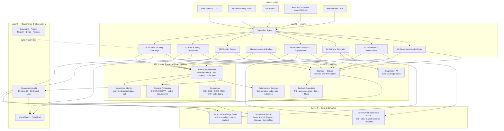

# Suite Architecture Reference
### EDU AI Agent Suite — Six-Layer Architecture and AWS Service Mapping

---

## Overview

The suite is organized into six horizontal layers, each with a distinct responsibility. Concerns do not bleed between layers: a change to the observability layer does not affect agent logic; a change to the model layer does not affect authorization. This separation is what makes the platform extensible to additional agents and auditable by a privacy/compliance function.

The architecture follows one principle above all: **the best EDU architecture is not one giant agent with access to everything — it is a collection of bounded agents and narrowly-scoped tools, where the user's identity follows every request, retrieval respects existing permissions, read and write are separated, high-impact actions require confirmation, every source/recommendation/API-call/approval is logged, the SIS/LMS/ERP/CRM remains the system of record, and the institution can disable any agent or tool immediately.**

```
┌─────────────────────────────────────────────────────────────────────────┐
│  LAYER 6 — GOVERNANCE & OBSERVABILITY                                   │
│  Grounding · Prompt registry · Eval harness · Audit · Fairness · Alerts │
├─────────────────────────────────────────────────────────────────────────┤
│  LAYER 5 — MODELS & DETERMINISTIC SERVICES                              │
│  Bedrock (Claude) · Guardrails · Degree/rules engines · PII masker      │
├─────────────────────────────────────────────────────────────────────────┤
│  LAYER 4 — DATA & SEMANTIC LAYER                                        │
│  Knowledge bases · Vector search · Governed student-data lake · RWD     │
├─────────────────────────────────────────────────────────────────────────┤
│  LAYER 3 — TOOL & INTEGRATION LAYER (MCP AUTHORIZATION GATEWAY)         │
│  AgentCore Gateway · AgentCore Identity · Connectors · Student-PII Mask │
├─────────────────────────────────────────────────────────────────────────┤
│  LAYER 2 — SUPERVISOR & SPECIALIST AGENTS                               │
│  LangGraph orchestration · Specialist agent graphs · HITL gates          │
├─────────────────────────────────────────────────────────────────────────┤
│  LAYER 1 — UX IN EXISTING APPLICATIONS                                  │
│  LMS panels · Student/family portal · Teams · Amazon Connect · Web/API   │
└─────────────────────────────────────────────────────────────────────────┘
```

---

## Layer 1 — UX in Existing Applications (Experience Layer)

Agents surface inside the applications students, families, and staff already use — not as standalone AI portals that require a context switch. Integration patterns:

- **LMS panel** (Canvas, Blackboard, Schoology, Moodle, D2L): an embedded assistant for the course or assignment in focus, via an institution-approved interoperability interface (LTI 1.3 / LTI Advantage).
- **Student or family portal**: the Concierge and Pathway Navigator surfaced in the existing student/parent portal, with the authenticated identity forwarded.
- **Microsoft Teams / collaboration tools**: staff-facing agents (Educator Copilot, Operations Service Desk) where staff already work.
- **Amazon Connect**: voice, SMS, chat, and contact-center channels for the Concierge and Student Success outreach — including after-hours self-service.
- **Web and mobile applications**: a thin web/mobile front end; the reference Streamlit dashboard is suitable for internal demonstration and early pilots before deep system integration.
- **REST / webhook API**: all agent graphs expose a stateless invocation endpoint compatible with AgentCore Runtime's `/invocations` contract.

The UX layer is intentionally thin. It captures the user's identity (forwarded as IdP claims) and role, passes task context, and renders the agent's structured output. **It must meet WCAG 2.2 AA** — student-facing surfaces are subject to ADA and Section 508. Authorization happens at Layer 3, not the UI.

---

## Layer 2 — Supervisor and Specialist Agents

Each of the eight specialist agents is a **LangGraph StateGraph** — a directed, stateful workflow with deterministic routing and a framework-enforced interrupt for human approval.

### Specialist Agent Pattern

```
Intake → [Retrieval nodes] → Draft / Analyze → [Policy & compliance gate] → Routing → HITL Gate → Finalize
```

The routing node decides whether the output is clean (routes to HITL gate), requires one bounded revision (loops back), or is prohibited (escalates). Every path through the graph leads to a human decision; **there is no path from intake to finalize that bypasses the HITL gate** for a consequential action.

### Supervisor Agent (Multi-agent workflows)

For workflows that span agents (e.g., a student-success case that touches both Student Success and the Pathway Navigator), a lightweight supervisor routes intent to the appropriate specialist, forwards the original user claims and role, and aggregates results. The supervisor holds **no tool grants** — it can only invoke specialists, never systems of record directly. Orchestration stance is recorded as ADR-001 in `ENTERPRISE-PLATFORM.md`: in-process LangGraph today; A2A-through-AgentCore when cross-agent autonomy is needed.

### Human-in-the-Loop (HITL) Gate

Implemented via LangGraph `interrupt_before` on the `finalize` node. The graph suspends, the draft and compliance report are surfaced to a named reviewer in the appropriate role (educator, counselor, registrar, administrator), and execution resumes only when a verified approval record is written to the HITL queue table. The gateway enforces that the approval record contains a valid reviewer identity before minting the write token for the downstream system. The native rebuild uses Step Functions `waitForTaskToken` for the same gate.

---

## Layer 3 — Tool and Integration Layer (MCP Authorization Gateway)

The governed front door. Every agent tool call — read or write — passes through this layer. **No agent has a direct network path to a system of record.** See `docs/WHY-THE-MCP-LAYER.md` for the business case and the three implementation options (managed AgentCore Gateway, AWS primitives, or self-built FastMCP server).

### Components

- **AgentCore Gateway** (production: `infra/cloudformation/agentcore-gateway.yaml`; reference logic: `platform_core/edu_agent_platform/mcp_gateway/`): registers tool targets, runs the authorization decision, enforces the human-approval gate for high-risk tools.
- **AgentCore Identity** (production: AgentCore Identity service; reference: token minting): short-lived, per-call credentials scoped to exactly the requested tool; no standing service accounts.
- **Connector framework** (`platform_core/edu_agent_platform/connectors/`): per-system adapters — SIS (PowerSchool, Infinite Campus, Banner, Workday Student), LMS (Canvas, Blackboard, Schoology, Moodle, D2L), CRM (Slate, Salesforce EDU), ITSM (ServiceNow, Jira), ERP/finance, scheduling, transportation, library; implements the `invoke(method, args)` interface; fixture mode in demo, live in production.
- **Student-PII masker** (`platform_core/edu_agent_platform/pii_masker/`): NER-based recognition runs before any inbound tool result enters a prompt or audit record; stable pseudonyms allow cross-call tracing without exposing FERPA-protected identifiers or COPPA-protected data for under-13 learners.

### Narrowly-scoped tools (examples)

`get_student_schedule` · `check_application_status` · `create_advising_case` · `draft_family_message` · `update_assignment_due_date` · `submit_it_ticket`. Each tool has a single purpose; read and write capabilities are separate tools with separate grants. The agent never receives direct database credentials or unrestricted API access.

---

## Layer 4 — Data and Semantic Layer

The retrieval substrate that grounds agent outputs:

- **Amazon Bedrock Knowledge Bases** (vector store backed by OpenSearch Serverless or Aurora pgvector): approved institutional content — policies, catalogs, course materials, syllabi, financial-aid and enrollment guidance, IT knowledge — segmented by institution, course, section, and learner role so retrieval respects existing permissions.
- **Governed student-data lake** (S3 + AWS Glue + Lake Formation + Redshift): the analytics substrate for Student Success and operational reporting, with fine-grained, role-aware access. Strong limits on which data domains may be combined.
- **Structured operational data**: SIS attendance/enrollment, LMS engagement, advising cases — retrieved via gateway-authorized connectors, not direct DB access.
- **Real-world / labor-market data**: program, credential, and career data for the Pathway Navigator, in a governed data layer.
- **Ingestion**: Amazon Textract (documents, PDFs, handwriting), Amazon Transcribe (audio, oral-reading and spoken responses) feed enrollment processing, accessibility transformation, and assessment.

---

## Layer 5 — Models and Deterministic Services

- **Amazon Bedrock (Claude models)**: primary inference; reached over AWS PrivateLink (an interface VPC endpoint) rather than the public internet — Bedrock runs in the AWS service, reached privately. Direct identifiers are minimized/masked before inference, so requests leaving the VPC over the endpoint carry masked content rather than raw student PII.
- **Bedrock Guardrails**: configured at the stack level (`infra/cloudformation/security.yaml`); enforces PII denial, age-appropriate content for student-facing surfaces (heightened for minors and under-13 per COPPA), prohibited-behavior blocking (e.g., completing a prohibited assessment), and topic filters. Runs on every LLM call automatically — supplementing, never replacing, Layer 3 authorization.
- **Deterministic services**: not everything needs an LLM. Degree-audit, graduation, and prerequisite rules (Pathway Navigator); rubric score calculation (Assessment); completeness validation (Document Services); and prohibited-language detection are deterministic Python — fast, testable, and consistent enough to include in validation evidence. Predictive models (e.g., early-warning) run in **Amazon SageMaker AI** where prediction is justified, and are kept separate from the explanation and human-decision stages.

---

## Layer 6 — Governance and Observability

Runs continuously, in every environment. Full detail in `governance/README.md`.

- **Grounding verification** (`governance/grounding.py`): every fact, deadline, policy statement, or figure in a student/family-facing artifact is traced to approved institutional content; ungrounded claims fail fast.
- **Prompt version registry** (`governance/prompt_registry.py`, `prompt_manifest.json`): prompts are hash-pinned; CI fails on un-bumped drift — model-change control.
- **Eval harness** (`governance/evals/`): structural regression over reviewed golden artifacts (advising plans, intervention drafts, rubric-graded feedback, accessible-content output); runs in CI without API keys.
- **HITL gate tests** (`governance/tests/test_hitl_gates.py`): asserts framework-enforced approval cannot be bypassed.
- **Red team** (`governance/redteam/`): prompt injection (including injection hidden in a student-submitted document or inbound email), PII exfiltration, authorization bypass.
- **Fairness** (`governance/fairness/`): equity/representativeness checks and false-positive/false-negative monitoring for student-success targeting and intervention recommendations.
- **CloudWatch**: invocation counts, latency, error rates, HITL queue depth, approval latency, with anomaly alarms.
- **CloudTrail**: API-level audit of all AWS calls; feeds the same append-only audit trail as gateway events for a unified compliance record aligned to FERPA recordkeeping.

---

## Mermaid Diagram — Full Suite Reference Architecture



---

## AWS Service Mapping

| Architecture role | AWS service | Notes |
|---|---|---|
| Agent runtime (container) | **Amazon Bedrock AgentCore Runtime** | ARM64 container; `/invocations` + `/ping`; autoscaling |
| Agent runtime (native/serverless) | **AWS Step Functions + Lambda** | `waitForTaskToken` HITL gate; deterministic core |
| Agent orchestration | **AWS Step Functions** | Parallel fan-out for multi-agent; audit in CloudWatch |
| MCP authorization gateway | **Amazon Bedrock AgentCore Gateway** | Target registration; authorizer; deny-by-default (Options B/C: API Gateway+Lambda, or FastMCP) |
| Federated identity + scoped tokens | **AgentCore Identity + Amazon Cognito / IAM Identity Center** | IdP federation (Okta/Entra/Google Workspace/AD); short-lived credentials; student/guardian/educator/counselor/admin role mapping |
| LLM inference | **Amazon Bedrock (Claude models)** | Reached over PrivateLink (interface VPC endpoint), not the public internet; identifiers masked before inference; model-access policies |
| Content safety + PII controls | **Amazon Bedrock Guardrails** | PII denial; age-appropriate filters for minors; prohibited-behavior topic filters |
| Knowledge base / vector search | **Amazon Bedrock Knowledge Bases** | OpenSearch Serverless or Aurora pgvector; segmented by institution/course/role |
| Governed analytics | **S3 + Glue + Lake Formation + Redshift** | Fine-grained, role-aware student-data lake |
| Predictive models | **Amazon SageMaker AI** | Early-warning/recommendation models where prediction is justified |
| Document & media ingestion | **Amazon Textract + Transcribe** | Enrollment docs, handwriting, captions, oral-reading assessment |
| Translation & speech | **Amazon Translate + Polly** | Multilingual family comms, accessible audio/captions |
| Append-only audit trail | **Amazon DynamoDB** (append-only policy) | `deny:UpdateItem`/`deny:DeleteItem` on audit partition; PITR; FERPA disclosure recordkeeping |
| WORM document store | **Amazon S3 + Object Lock** (COMPLIANCE mode) | Submitted enrollment documents; finalized audit snapshots; records-retention support |
| Encryption at rest + key management | **AWS KMS** (customer-managed key) | Separate key per environment; key policy restricts to agent role |
| Operational observability | **Amazon CloudWatch** | HITL queue depth; approval latency; error-rate alarms |
| API-level audit | **AWS CloudTrail** | All API calls; feeds unified compliance record |
| Network isolation | **Amazon VPC** | No public inbound; Bedrock via VPC endpoint; inter-service traffic stays in VPC |
| IaC — primary | **AWS CloudFormation** | `infra/cloudformation/quickstart.yaml` master stack |
| IaC — parity | **Terraform** | `infra/terraform/`; identical resource topology |
