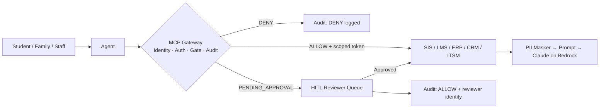

# Teaser Deck — EDU AI Agent Suite
### Executive Summary for First-Meeting Distribution

> This is the leave-behind and pre-read for the first executive meeting — superintendent, president, CIO, or board. Five slide-equivalent sections, each written to stand alone. The full story is in `ENTERPRISE-PLATFORM.md` and `SOLUTION-FIELD-GUIDE.md`.

---

## Slide 1 — The Problem You Already Know

**Your systems hold the answers. Your people can't get to them.**

Every institution already owns the systems that hold the answers — the student information system, the LMS, the ERP, the CRM, the service desk. The pain is that the data is locked behind portals, PDFs, and staff inboxes, reachable only by a human who knows which screen to open.

The result:
- Families call the wrong office, wait on hold, and email at midnight — because the answer was always there, just unreachable.
- Financial-aid, registrar, and enrollment staff absorb a seasonal deluge of routine status inquiries that crowd out the complex work that actually needs a human.
- Advisors carry caseloads too large to catch early warning signs before a student disengages.
- Teachers spend hours reformatting and differentiating the same material for different needs and levels.
- IT and administrative staff triage the same repetitive tickets, day after day.

None of this is a data problem. It is an access problem. AI agents are valuable precisely because they can close that gap — but only if they can reach your systems safely.

**Speaker notes:** Open with the service-owner's specific pain — the number of emails, the after-hours call volume, the seasonal peak. Make the baseline concrete before you offer the solution. The more specific the pain, the more credible the outcome numbers that follow. Ask: "What does that cost you in staff hours during FAFSA season?" and let the number sit in the room.

---

## Slide 2 — The Reframe: The Hard Part Is Not the Model

**The hard part is governed access to the data.**

Most education AI programs do not stall on the model. They stall at the security and privacy review — when the CISO asks who is allowed to do what, whether a human signs off on consequential actions, and whether every access to a student record can be proven to a parent or an auditor.

The answer to all three questions is *no* if each agent simply holds API keys and calls systems directly. That is where programs fail.

So the right frame is not "which AI model" — it is "how do agents get clean, governed access to your systems of record, with identity, least privilege, human approval on consequential actions, and a complete audit trail?"

Solve that once and every agent benefits. Skip it and every agent stalls.

**The EDU AI Agent Suite builds that governed layer first — and every agent reuses it.**

The MCP Authorization Gateway — one enforcement point between every agent and every system of record — provides:
1. **Identity** — verified claims from the institution's own SSO; deny on missing subject
2. **Deny-by-default authorization** — the agent can never exceed the human it acts for; roles distinct for student, guardian, educator, counselor, and administrator
3. **Human approval gate** — consequential tools block until a verified reviewer identity is bound into the record
4. **Short-lived scoped tokens** — minted per call; no standing service accounts
5. **PII-masked, append-only audit** — every access logged with lineage, satisfying FERPA recordkeeping of disclosures

**Speaker notes:** This slide does the most work. The key move is "not which model, but how does the model get governed access." Once that reframe lands, the gateway-first sequencing is obvious — it's not a technical choice, it's what makes the whole program possible. If the CISO is in the room, slow down here and ask: "What does your current vendor AI review look like when a vendor requests API access to Banner?" Their answer tells you exactly what problem the gateway solves.

---

## Slide 3 — What We Built: A Governed Platform, Not Eight Chatbots

**The agents are the visible surface. The platform is the product.**

The suite delivers eight high-value education workflows on a shared, governed platform. Controls compound: a governance improvement to the PII masker, the grounding checker, or the audit trail benefits all eight agents simultaneously.

| # | Agent | The problem it solves |
|---|---|---|
| **01** | Student & Family Services Concierge | Families can't find anything; staff buried in routine contacts. 24/7 governed front door — answers, checks status, schedules, opens cases, escalates. |
| **02** | Personalized Tutor & Study Companion | Students need help at scale outside class hours. Curriculum-grounded, instructor-controlled Socratic support. |
| **03** | Educator Copilot | Teachers spend hours adapting content and navigating the LMS. Drafts lessons, differentiates, builds rubrics — always educator-approved before publish. |
| **04** | Assessment, Grading & Feedback | Open-ended grading and detailed feedback are slow. Rubric-grounded draft evaluation; educator owns the grade. |
| **05** | Student Success & Proactive Engagement | Warning signs accumulate before anyone acts. Assembles evidence, drafts interventions, opens cases. |
| **06** | Academic, College & Career Pathway Navigator | Degree and transfer rules are complex; advisor caseloads are huge. Course planning, graduation requirements, transfer-credit mapping, career exploration. |
| **07** | Document & Accessibility Services | Enrollment is document-heavy and seasonal; institutions must serve everyone accessibly and multilingually. |
| **08** | Operations Service Desk | IT and admin staff drown in repetitive tickets around the clock. |

**The bright line — what these agents never decide:** Grades. Admissions. Discipline. Financial-aid awards. Special-education eligibility. Student placement. Every consequential action is gated to a named, authorized human — encoded as policy and tested in the codebase, not merely documented.

**Speaker notes:** Don't walk through all eight agents in a first meeting. Pick the two the service owner already named as painful. Show the table as context — "here's the portfolio" — then zoom into the two they care about. The point of showing all eight is the build-once economics: "you pay for the gateway once on Agent 01; every one of these inherits it."

---

## Slide 4 — Proof Points

**Verified reference outcomes from peer institutions.**

We don't cite internal projections. We cite verified outcomes from peer institutions that have deployed comparable workflows on AWS.

| Institution | Workflow | Outcome |
|---|---|---|
| **University of Arkansas – Pulaski Technical College** (MyAgent, Modo Labs + AWS) | Concierge-class student services | 94.5% adoption; 253% year-over-year lift in admissions engagement |
| **Highline College** (financial-aid self-service, AWS) | Financial-aid status and FAFSA support | ~75% reduction in financial-aid status contacts; FAFSA processing time roughly halved |
| **Illinois Institute of Technology** | Transcript evaluation (document processing pattern) | 4–6 weeks → ~1 day cycle time reduction |
| **UT Austin** (UT Sage, Amazon Bedrock) | Faculty-guided tutoring at scale | Faculty-controlled tutoring with institutional guardrails |

**How to read these:** These set expectations. They are not guarantees for your institution. Your pilot proves your own result against your own baseline — the specific deflection rate, cycle-time improvement, and staff-hours reclaimed in your environment and with your workflows.

**The ROI model** measures outcomes, not conversations. We baseline five categories before deployment (Labor, Service, Learning, Student journey, Risk & quality) and measure the change after. A high-traffic agent that changes nothing is a failure. A moderate-traffic agent that halves a processing time is a success. See `gtm/roi-calculator/` for the TCO/ROI calculator.

**Speaker notes:** Let the numbers land without overselling them. Say: "These are from peer institutions — community colleges, universities, K–12 districts — on AWS. They are what made us confident the use cases are proven. Your pilot is what proves your number." If the CFO is in the room, ask: "What would a 60% reduction in routine financial-aid contacts mean in staff hours per year?" Let them calculate their own ROI.

---

## Slide 5 — The Path from Here

**Assessment → POC → Pilot (gateway-first) → Managed Service → Portfolio expansion.**

| Step | What it is | Typical timeline |
|---|---|---|
| **Discovery & Readiness Assessment** | Diagnostic — FERPA/COPPA posture, IdP and role mapping, system inventory, accessibility baseline, state-law mapping, use-case prioritization. Produces a signed readiness roadmap. | 3–5 weeks |
| **Demo-Mode POC** | Runs in `EXTRACT_MODE=demo` — no API keys, no live systems, no student PII. Leadership, CISO, privacy officer, and academic stakeholders watch a deny, a PII mask, and a human-gated write happen. Go/no-go decision. | 2–4 weeks |
| **Pilot (gateway-first)** | One agent, one live system of record, in your AWS account. Gateway and identity built first (Phase 1) — because the gateway is what passes the security and privacy review, and every subsequent agent reuses it. Outcome measured against a pre-deployment baseline. | 6–12 weeks |
| **Managed Service** | SI runs the platform in production: HITL queue operations, model/prompt change control, eval and fairness monitoring, accessibility maintenance, incident response, monthly outcome reporting. | Ongoing |
| **Portfolio expansion** | Each additional agent inherits the control plane already built — marginal cost dominated by the connector, not rebuilding governance. | Per roadmap |

**Who pays for the pilot:** AWS funding programs — Partner Originated Activation (PoA) credits, Migration Acceleration Program (MAP), and Partner Development Funds — can offset POC and pilot infrastructure costs. See `docs/AWS-FUNDING-AND-PREREQUISITES.md` for the 4-step funding sequence. The suite is available via AWS Marketplace private offer, drawing against existing AWS spend commitments. See `offerings/AWS-MARKETPLACE-GUIDE.md`.

**The first step is always the same:** Find the most acute, most visible, most measurable pain — and start a discovery conversation. The Concierge is almost always the answer.

**Speaker notes:** Close every first meeting with a next-step commitment: "The readiness assessment takes 3–5 weeks. At the end, you have a signed roadmap — your FERPA/COPPA posture mapped to the platform controls, your IdP design, your system inventory, your use-case priority order, and your recommended pilot target. That's the input your security and privacy teams need to say yes to the pilot. Can we schedule the kickoff?" If budget is the objection, offer the POC first — 2–4 weeks, no live systems, no AWS account needed, and we can fund it through AWS PoA credits.

---

*Full collateral: `ENTERPRISE-PLATFORM.md` (platform thesis) · `SOLUTION-FIELD-GUIDE.md` (qualification and motion) · `offerings/` (assessment, POC, pilot, managed service, ROI, objections, competitive, TPRM) · `docs/WHY-THE-MCP-LAYER.md` (gateway argument) · `docs/STAKEHOLDER-SECURITY-BRIEFINGS.md` (per-stakeholder briefings) · `docs/WELL-ARCHITECTED-GENAI-LENS.md` (AWS WAF mapping) · `gtm/roi-calculator/` (TCO/ROI calculator)*
